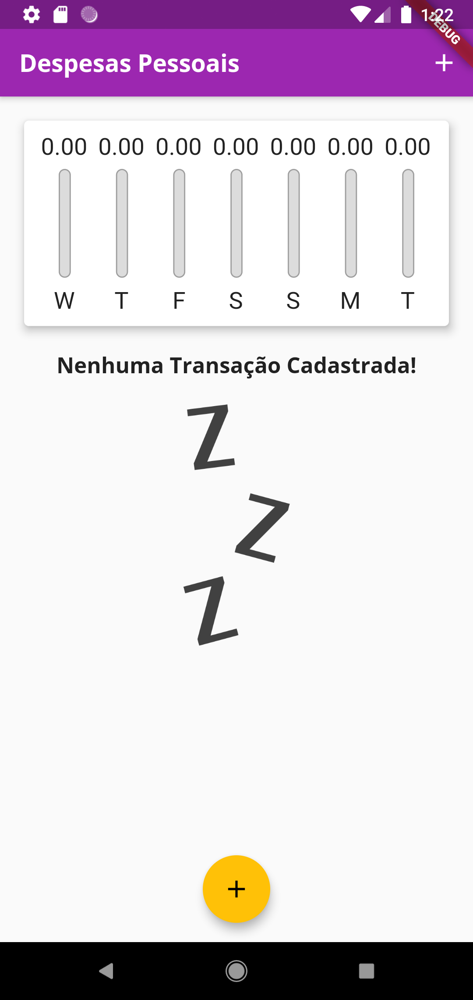
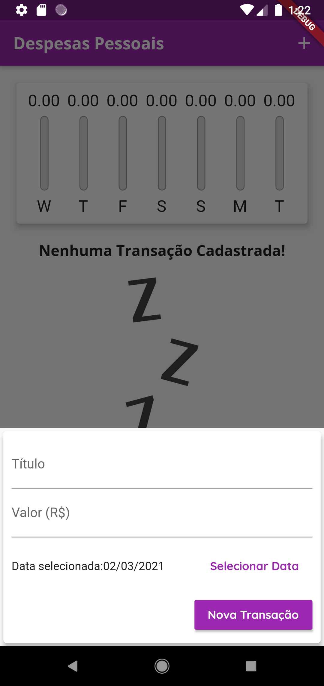
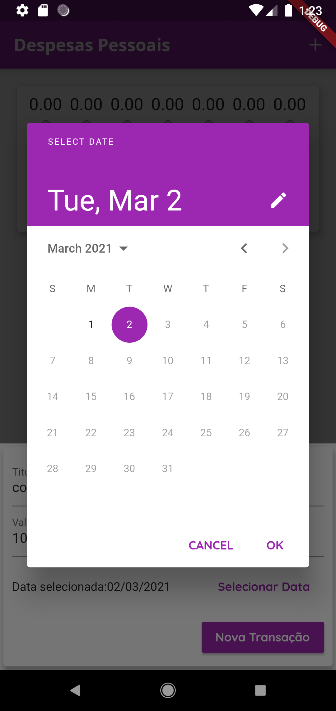
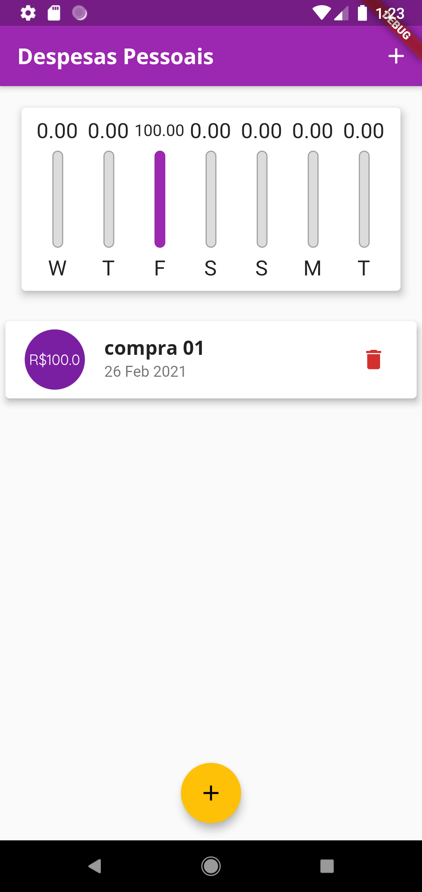
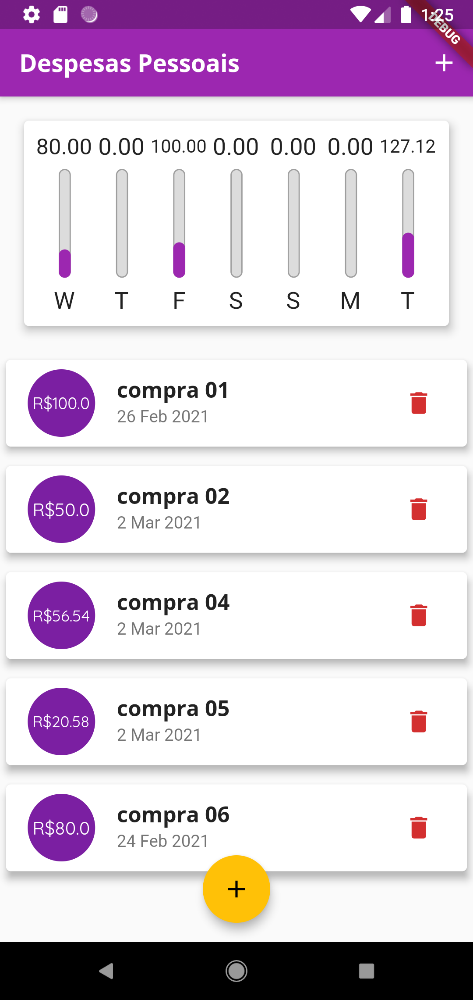

# Expense manager

Olá, este é um projeto em flutter de um gerenciador de despesas!

Este projeto é um aplicativo para controlar os gastos do dia a dia, e ter o controle de quanto foi gasto por dia e em qual dia mais foi gasto.

  

## Screenshots
<table>

<tr>

<td></td>
<td></td>

</tr>

<tr>

<td></td>
<td></td>
<td></td>

</tr>

</table>
